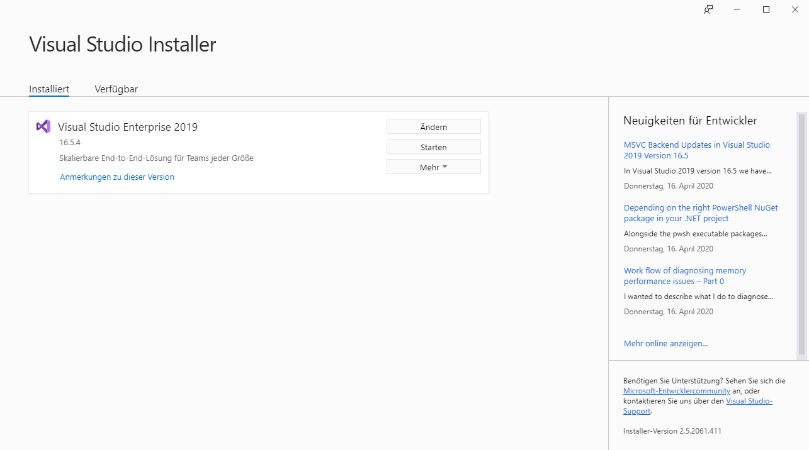
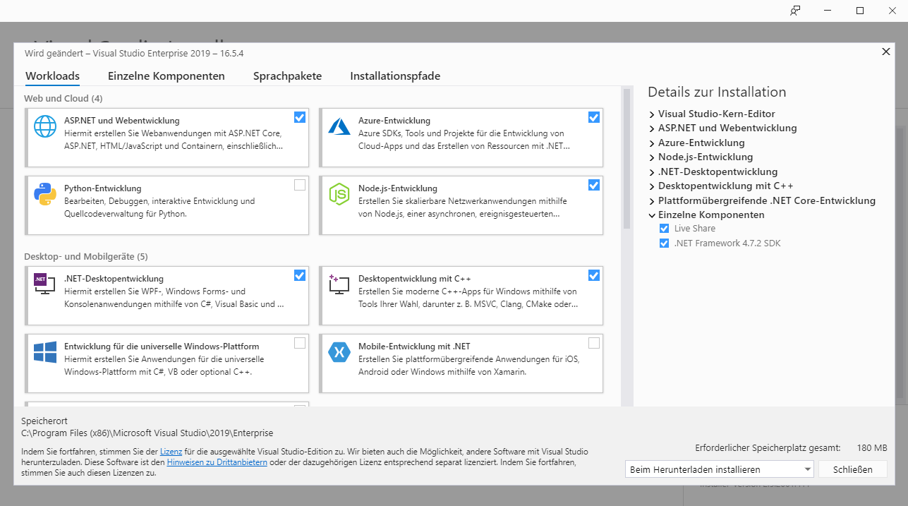

# Preparation

## Editor
For compiling the c++ code with the microsoft compiler it is recommended downloading the Visual Studio Editor.
 The version Visual Studio Enterprise oder Visual studio Community can be used.
 The Community version can be downloaded for free under this link: https://visualstudio.microsoft.com/de/vs/community/  
 Follow the install instructions.

## Visual Studio installer
Visual Studio comes with an extra tool downloader called `Visual Studio Installer`.
For developing with C++, start the Installer and select ``change``. 

In the now opening window select ``Desktop ENTWICKLUNG MIT C++``. On the bottom of the page hit ``Ändern`` (engl. Change).

[NEXT PAGE](2_download_aml_engine.md)
