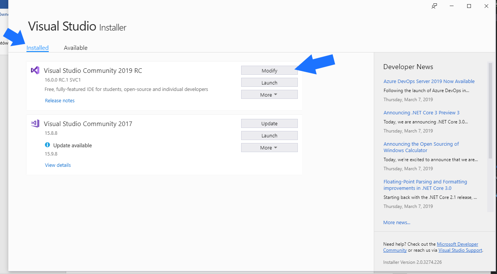
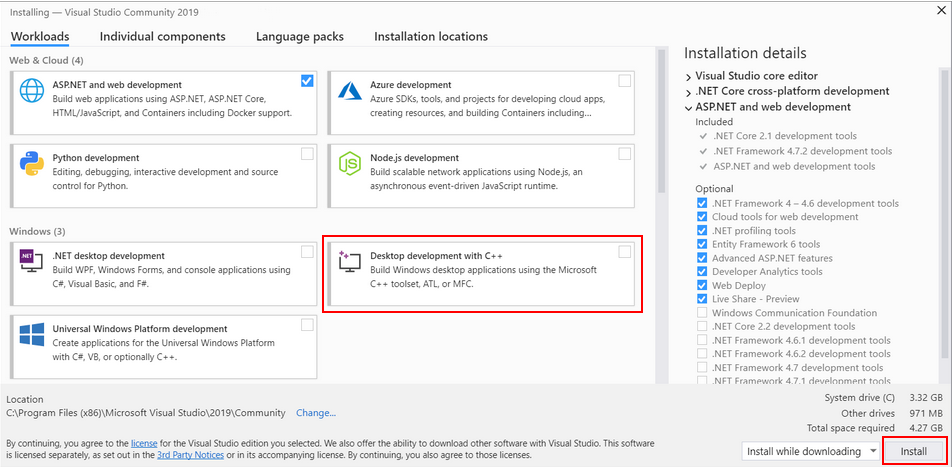

# Preparation
If there are any problems in this chapter, take a look at the [microsoft install instruction for C++ support in Visual Studio](https://docs.microsoft.com/en-us/cpp/build/vscpp-step-0-installation?view=vs-2019).
It has basically the same content.
## Editor
For compiling the c++ code with the microsoft compiler it is recommended downloading the Visual Studio Editor.
 The version Visual Studio Enterprise or Visual studio Community can be used.
 The Community version can be downloaded for free under this link: https://visualstudio.microsoft.com/de/vs/community/  
 Follow the install instructions.

## Visual Studio installer
Visual Studio comes with an extra tool downloader called `Visual Studio Installer`.
For developing with C++, start the Installer and select ``Modify`` on the correct version.

In the now opening window select ``Desktop development with C++``. On the bottom of the page hit ``install`` (engl. Change).

[NEXT PAGE](2_download_aml_engine.md)
