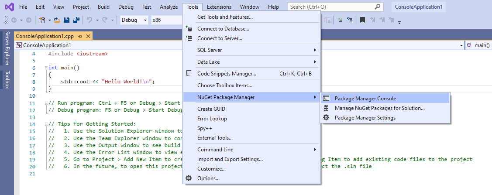
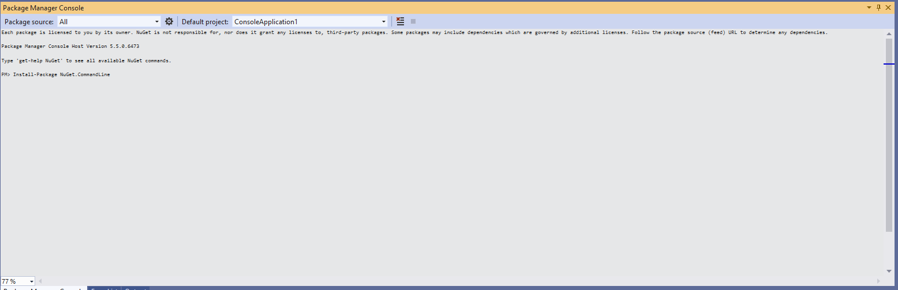
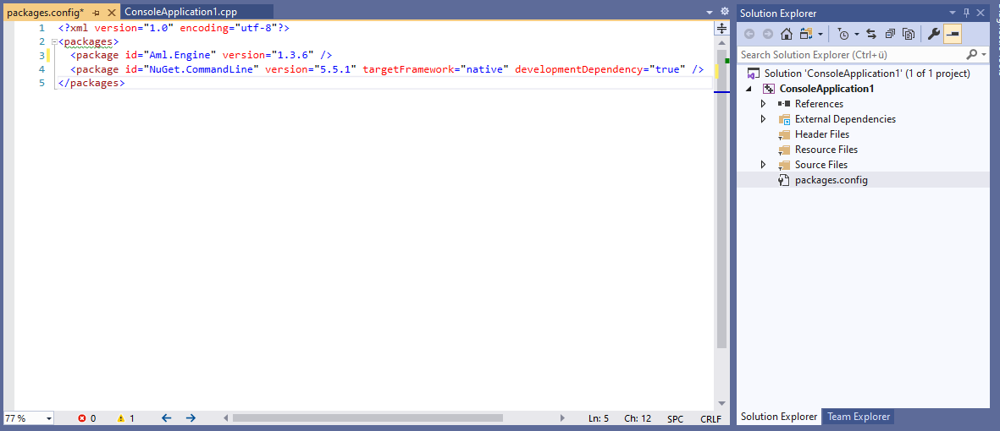
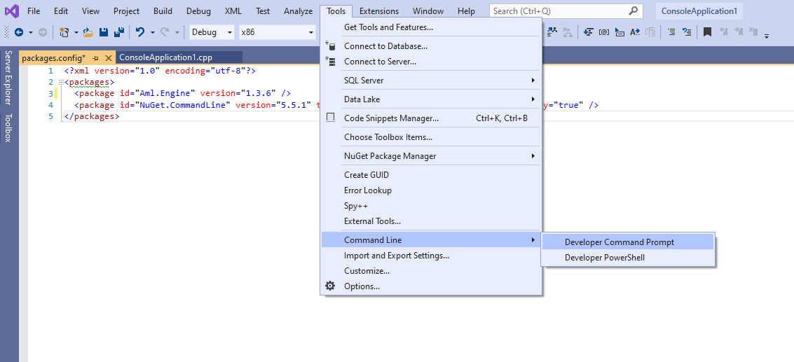
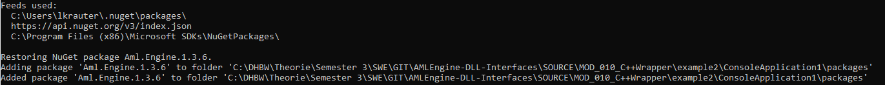
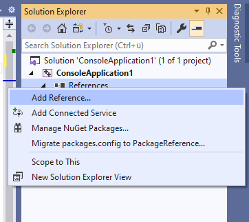

# Download the Aml Engine
For installing the dll package in our project, we nearly follow the instructions from [this StackOverflow answer](https://stackoverflow.com/questions/18694947/how-can-i-make-my-managed-nuget-package-support-c-cli-projects).

## 1. Install ``Nuget.exe``

First of all start the Package Manager Console, found under the links in the picture:



In the console copy and paste following command:
````bash
Install-Package NuGet.CommandLine
````
This will download the tool ``nuget.exe``. With this tool, we can download the Aml.Engine.dll.


## 2. change ``package.conf``

In the Solution Explorer on the right sight select the file ``packages.config``.
Between the tags ``packages``, paste following line:
````
<package id="Aml.Engine" version="1.3.6" />
````
...so that it looks like in the picture.



## 3. Install the packages
We now need to start a console in the directory.
Start the console like in the picture:



In the command prompt copy following command.
Two things has to be changed in this command.
- the project name, if you haven't changed it, it's probably ``ConsoleApplication1``
- the nuget-commandline version

````
.\packages\NuGet.CommandLine.5.5.1\tools\NuGet.exe Install -NonInteractive -OutputDirectory packages ConsoleApplication1\packages.config
````
The console should print something similar to the output in the picture.


## 4. Adding a reference

Now right-click on ``References`` and choose ``Add Reference`` in the right handed sided Solution Explorer.


In the new window select the tab ``Browse`` and hit the button ``Browse..`` on the bottom.
In the window explorer navigate to the package directory and select the Aml.Engine.dll
Here you have to choose which .Net Version you have installed. navigate in the correct version.
 Also jot down this version, as we need it later. An example would be:
````
<absolute Path ot project directory>/ConsoleApplication1\packages\Aml.Engine.1.3.6\lib\net4.7\AML.Engine.dll
````

[NEXT PAGE](3_add_sample_code.md)