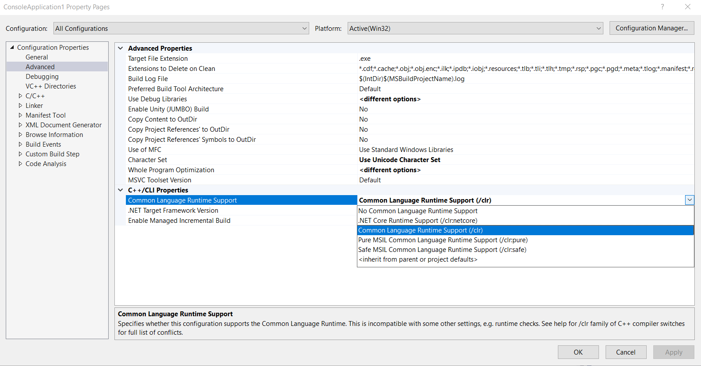
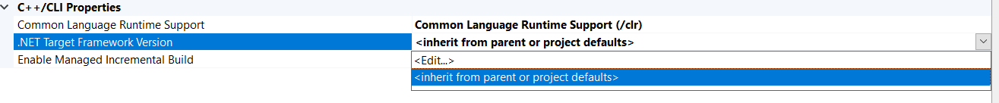
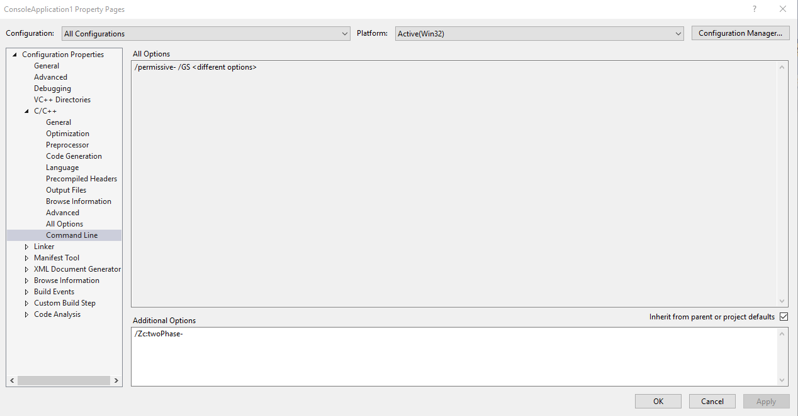
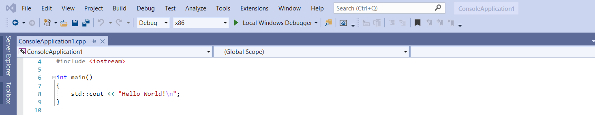

# Compiling

## Compiler Settings - Runtime

In the Solution Explorer on the right hand side open the project settings with a right-click on the main project node.
Follow the options ``Configuration Properties -> Advanced -> C++/CLI Properties``.



In the option one below hit the option ``inherit from parent or project defaults``.


If later on there is a error message, warning about the wrong .Net Version. Then hit ``edit``.
In the new window write the version, we memorized. In the case of this tutorial it was ``4.7``.


After the settings hit apply, but leave the window open, as we still need for the next step.

## Compiler Settings - compiler behavior

In the project settings select ``Configuration Properties -> C/C++ -> Command Line``
Paste the following command in the window ``Additional Options`` at the bottom.
````
/Zc:twoPhase-
````
Resources for deeper explanations can be found [here](https://docs.microsoft.com/en-us/cpp/build/reference/zc-twophase?view=vs-2019).



## Start the Compiler
In the editor press the compile button on the top of the editor window.



Now the compiler started and should run through, and run though the main method. If not check this [link](common_warnings.md).
